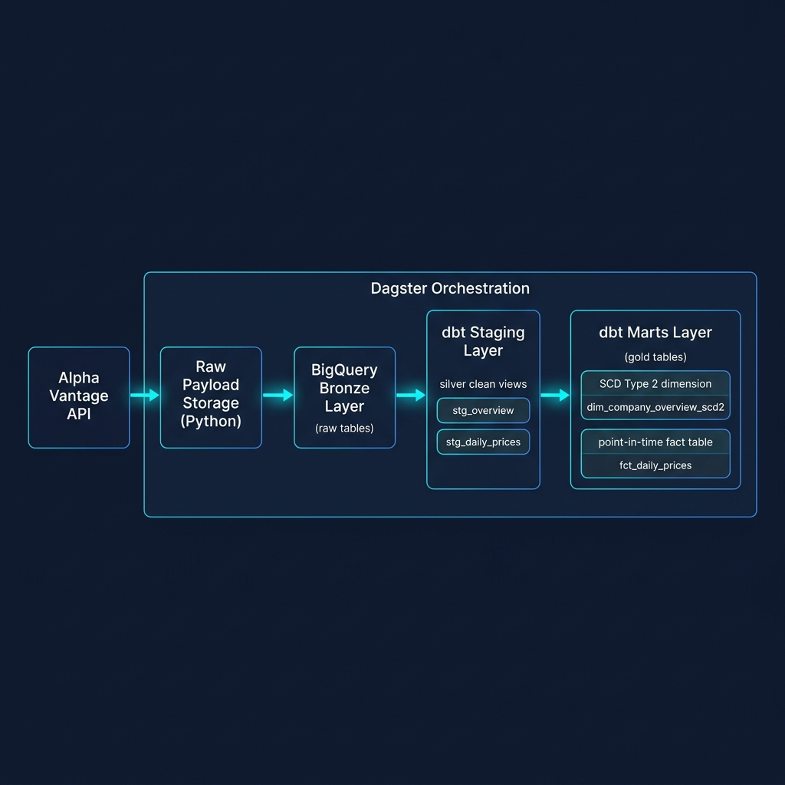
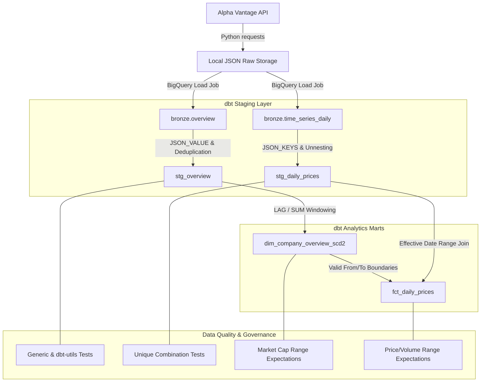
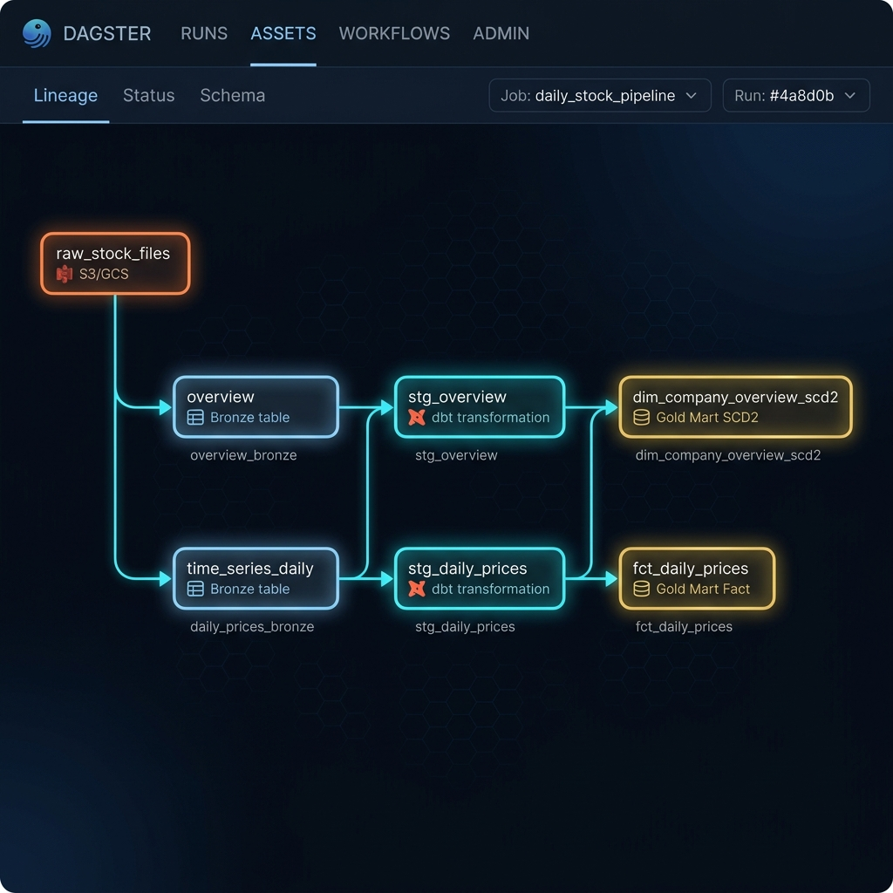

# Medallion Markets: Financial Data Lakehouse & Analytics Warehouse

An end-to-end data platform built on BigQuery, dbt, and Dagster. The platform ingests equities market data and company fundamentals from the Alpha Vantage API, lands raw payloads in a BigQuery **Bronze** layer, transforms data through an **SCD Type 2** dimension and point-in-time fact model via **dbt**, enforces strict data quality assertions using **dbt-expectations**, and orchestrates the end-to-end lineage graph using **Dagster**.

## Executive Summary

The project demonstrates a Medallion Architecture (Bronze, Silver/Staging, Gold/Marts) designed for financial data processing. It solves core engineering challenges including non-destructive raw payload retention, dynamic JSON schema extraction, rate-limit failure isolation, point-in-time historical dimension tracking (SCD Type 2), and automated CI/CD validation.

<p align="center">
  
</p>

## Pipeline Architecture & Data Flow



---

## Data Pipeline Specifications

### 1. Ingestion Layer (Python & BigQuery)
- **Raw Landing**: Fetches raw market payloads (`TIME_SERIES_DAILY`, `OVERVIEW`) and saves formatted JSON files with ISO timestamp metadata (`_ingested_at`, `_source`, `_function`, `_symbol`).
- **Bronze Load Strategy**: Loads JSON records directly into BigQuery tables (`bronze.overview`, `bronze.time_series_daily`) using `WRITE_APPEND` load jobs, bypassing DML constraints while maintaining an audit log of ingested records.

### 2. Staging Layer (dbt Silver Models)
- **`stg_overview`**:
  - Extracts structural attributes (`Symbol`, `Name`, `Sector`, `Exchange`, `MarketCapitalization`).
  - Standardizes timestamps with `SAFE.PARSE_TIMESTAMP('%Y%m%dT%H%M%SZ', ingested_at)`.
  - Filters out Alpha Vantage rate-limit error responses (`where json_value(raw_json, '$.Symbol') is not null`).
  - Applies single-row deduplication per ticker using `ROW_NUMBER() OVER (PARTITION BY ticker ORDER BY ingested_at_ts DESC)`.
- **`stg_daily_prices`**:
  - Dynamically extracts variable date keys using BigQuery `JSON_KEYS(json_data['Time Series (Daily)'], 1)`.
  - Unnests daily price records into structured numeric fields (`open_price`, `high_price`, `low_price`, `close_price`, `volume`).
  - Deduplicates records by symbol and trading date.

### 3. Marts & Analytics Layer (dbt Gold Models)
- **`dim_company_overview_scd2` (SCD Type 2 Dimension)**:
  - Tracks historical changes to company attributes over time without reliance on BigQuery DML `MERGE` statements.
  - Computes change flags (`is_new_version`) via `LAG` comparisons across attributes (`sector`, `exchange`, `market_cap`, `company_name`).
  - Groups identical consecutive state pulls via cumulative sums (`SUM(is_new_version)`).
  - Calculates version effective windows (`dbt_valid_from`, `dbt_valid_to`, `is_current`) using `MIN()` grouping and `LEAD()` window functions.
- **`fct_daily_prices` (Point-in-Time Fact Table)**:
  - Joins daily historical market prices to the active company profile record at that specific point in time.
  - Expands lower validity bounds (`effective_valid_from`) to `1970-01-01` for the initial record state, enabling facts preceding initial ingestion to resolve correctly to Version 1 dimension attributes.

---

## Data Quality & Governance Framework

The pipeline enforces data integrity across staging and mart layers using generic, package-based (`dbt_utils`, `dbt_expectations`), and source freshness checks.

| Target Model | Test Name | Category | Asserted Logic | Severity |
| :--- | :--- | :--- | :--- | :--- |
| `stg_overview` | `not_null` | Schema | Ticker, Company Name, Sector, Exchange non-null | Error |
| `stg_overview` | `unique` | Schema | Ticker attribute is unique across staging | Error |
| `stg_overview` | `accepted_values` | Constraint | Exchange in `NYSE`, `NASDAQ`, `BATS`, `AMEX` | Error |
| `stg_daily_prices` | `unique_combination_of_columns` | Combination | `symbol` + `price_date` composite primary key | Error |
| `dim_company_overview_scd2` | `expect_column_values_to_be_between` | Expectation | Market Cap between `$0` and `$10,000,000,000,000` | Warn |
| `fct_daily_prices` | `expect_column_values_to_be_between` | Expectation | Close Price between `$0` and `$100,000` | Warn |
| `fct_daily_prices` | `expect_column_values_to_be_between` | Expectation | Volume between `0` and `10,000,000,000` | Warn |
| `fct_daily_prices` | `expect_table_row_count_to_be_between` | Table | Minimum 1 record present in fact mart | Error |
| `sources` | `freshness` | Source Freshness | Alert if bronze tables lack updates within threshold | Warn |

---

## Orchestration Graph (Dagster Integration)

Dagster manages the execution pipeline via `@dbt_assets` and `@multi_asset` definitions, producing a fully connected DAG:

<p align="center">
  
</p>

### Dagster Implementation Details
- **`DbtProject` & `DbtCliResource`**: Directly references `dbt_project/target/manifest.json`.
- **`CustomDagsterDbtTranslator`**: Dynamically maps dbt source definitions (`source.dbt_project.bronze.*`) to Dagster asset keys (`overview`, `time_series_daily`).
- **Asset Lineage**: Automatically derives upstream dependencies from dbt `ref()` and `source()` calls.

---

## CI/CD Pipeline (GitHub Actions)

Every Pull Request targeting `main` triggers `.github/workflows/dbt_ci.yml`:

1. **Environment Initialization**: Sets up Python 3.11 and installs `dbt-bigquery`, `sqlfluff`, and `sqlfluff-templater-dbt`.
2. **Credential Projection**: Writes secrets (`GCP_SA_KEY`) to an ephemeral `/tmp/gcp-key.json` file.
3. **SQL Linting**: Executes `sqlfluff lint models --dialect bigquery` using rules configured in `dbt_project/.sqlfluff`.
4. **Isolated CI Execution**: Executes `dbt build --target ci --exclude scd_company_overview` against a dedicated `dbt_ci` BigQuery dataset.

---

## Project Directory Structure

```
warehouse_project/
├── .github/
│   └── workflows/
│       └── dbt_ci.yml            # Automated CI/CD pipeline definition
├── dagster_project/
│   ├── definitions.py            # Main Dagster asset and dbt resource definitions
│   └── pyproject.toml            # Dagster project config
├── data/
│   └── raw/
│       ├── overview/             # Stored raw JSON responses (Overview)
│       └── time_series_daily/    # Stored raw JSON responses (Daily Prices)
├── dbt_project/
│   ├── models/
│   │   ├── staging/
│   │   │   ├── _sources.yml      # Source freshness & database bindings
│   │   │   ├── _staging.yml      # Staging tests & documentation
│   │   │   ├── stg_daily_prices.sql
│   │   │   └── stg_overview.sql
│   │   └── marts/
│   │       ├── _marts.yml        # Mart expectations & data tests
│   │       ├── dim_company_overview_scd2.sql
│   │       └── fct_daily_prices.sql
│   ├── .sqlfluff                 # Linter configuration
│   ├── dbt_project.yml           # dbt project configurations
│   ├── package-lock.yml
│   └── packages.yml              # Dependencies (dbt-utils, dbt-expectations)
├── docs/
│   └── assets/                   # Architecture and lineage visual diagrams
│       ├── architecture_pipeline_diagram.png
│       └── dagster_lineage_graph_diagram.png
├── scripts/
│   ├── fetch_stock_data.py       # API extraction script
│   └── load_to_bronze.py         # BigQuery bronze loader
├── .env                          # Environment variables (ignored)
├── .gitignore                    # Version control ignore rules
├── profiles.yml                  # dbt profile target definitions
├── README.md                     # Technical documentation
└── requirements.txt              # Environment Python packages
```

---

## Environment Variables Configuration

| Variable | Required | Description | Example |
| :--- | :--- | :--- | :--- |
| `ALPHA_VANTAGE_API_KEY` | Yes | API Key for Alpha Vantage endpoints | `YOUR_API_KEY` |
| `BQ_PROJECT_ID` | Yes | GCP Google BigQuery Project ID | `roycethreads-email` |
| `BQ_DATASET` | Yes | Target BigQuery raw dataset name | `bronze` |
| `GOOGLE_APPLICATION_CREDENTIALS` | Yes | Absolute path to GCP Service Account JSON key | `C:\keys\gcp-key.json` |

---

## Setup & Local Execution Guide

### 1. Repository Setup
```bash
git clone https://github.com/IbraheemRehan/medallion-markets.git
cd medallion-markets
pip install -r requirements.txt
```

### 2. Configure dbt Dependencies & Manifest
```bash
cd dbt_project
dbt deps
dbt parse
```

### 3. Execute dbt Models & Quality Checks
```bash
dbt build --exclude scd_company_overview
dbt source freshness
```

### 4. Launch Dagster UI
```bash
cd ../dagster_project
dagster dev
```
Open `http://localhost:3000` in your web browser to view the asset lineage graph and execute full pipeline materializations.

---

## BigQuery Sandbox Design Considerations

BigQuery Sandbox (Free Tier without an active billing account) restricts DML operations (`UPDATE`, `DELETE`, `MERGE`). To maintain compatibility:

1. **Bronze Ingestion**: Uses Python `load_table_from_json` load jobs (`WRITE_APPEND` / `WRITE_TRUNCATE`), which are executed as native load jobs rather than DML queries.
2. **SCD Type 2 Implementation**: Implemented as a view model (`dim_company_overview_scd2.sql`) using window functions (`LAG`, `SUM`, `LEAD`) over historical raw pulls rather than dbt's default DML-based snapshot mechanism.
3. **CI Execution**: Excludes snapshot nodes (`--exclude scd_company_overview`) during dbt build runs to maintain continuous integration compatibility.

---

## License

This repository is distributed under the MIT License.
